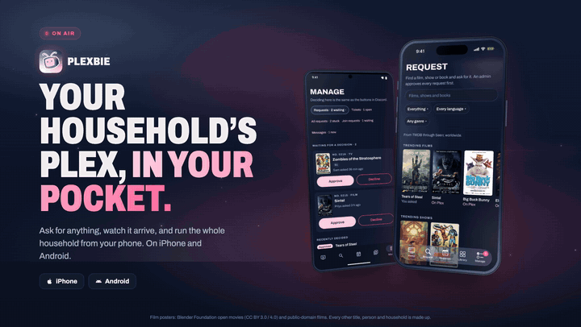
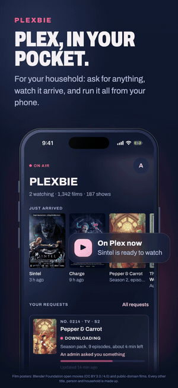
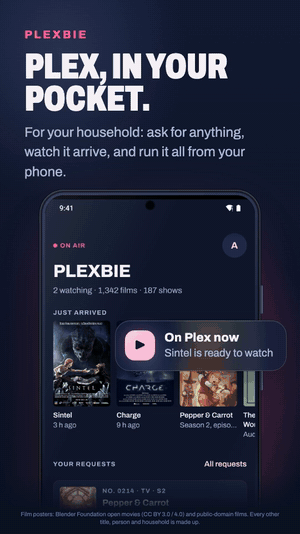

# Plexbie app

Plexbie's native app for iPhone and Android. It's built with Expo and React Native, from one TypeScript codebase.

<p align="center">
  
</p>

<table align="center">
  <tr>
    <td align="center"><br><sub><b>iPhone</b></sub></td>
    <td align="center"><br><sub><b>Android</b></sub></td>
  </tr>
</table>

<p align="center"><sub>Shown with the app's sample household. Film posters: <a href="https://studio.blender.org/films/">Blender Foundation</a> open movies and <a href="https://www.peppercarrot.com">Pepper &amp; Carrot</a> by David Revoy (CC BY), and public-domain films, serials and books. Every other title, person and household is made up.</sub></p>

The app is a client of a Plexbie server's `/api`: any Plexbie, on any address. Signing in
works like Plexbie's setup: members type their domain and the app fills in
`plexbie.<their domain>`, or they choose **Use a different address** for any other (a
Tailscale name, one they already use). The address must be https: release builds take plain
http only for the phone itself (`localhost`, `127.0.0.1`), so on Tailscale use its https name
(`….ts.net`, with Tailscale HTTPS on), not a `100.x` address. Every screen is native; the
website is not inside it.

**What it does:** sign in with Discord or Plex (PKCE, through the server's own page; the token
lives in the Keychain/Keystore), requests with live progress, Home, Library, the
Request page with Seerr discovery, Manage for admins, invites, alerts (Android), and its own
update notices. iPhone gets iOS 26 Liquid Glass.

**Invite links:** someone with an invite link and no Discord can use it in the app: **Have an
invite link?** on the sign-in screen (or **I have an invite link** after a sign-in that isn't
on the server yet) takes the pasted link, shows who it's from and until when it works, and
signs in with Plex, which accepts it, as the website's invite page does. Web invite links
still open the website (a household's own domain can't be tied to the app), but the app also
opens its own link, `com.plexbie.app://invite?server=<the Plexbie's address>&code=<the code>`.
It needs a Plexbie that answers `POST /api/invite/check`; an older one is told to use the
browser.

**Keeping a title forever:** Manage → Cleanup keeps any title on the clock with one switch,
and its **Keep a title forever** search finds any film or show on Plex by title, as
`/cleanup exempt add` does in Discord, leaving out the libraries cleanup skips. The search
needs a Plexbie that answers `GET /api/admin/cleanup/search`; an older one is told to update.

**Live progress (Android):** while one of your requests downloads, it stays in the notification
shade with a bar that fills up until it's on Plex; on Android 16 it's a Live Update, a chip in
the status bar. The bot sends silent updates (`core/live_progress.py` there) and the app draws
them in its own module, `modules/plexbie-live`, even when it's closed. Nothing shows before a
request is downloading, and a stuck one is taken down, as are all of them when alerts are turned
off or someone signs out. Tapping it opens the request, with Home
behind it (Back goes there, even when the tap started the app). It's on the You screen, with a preview;
if notifications are off for Plexbie, the preview says so and opens the phone's settings, and
the message goes once they're allowed and the app is back.

**Vibration:** Plexbie's own patterns (a little fanfare when a request is sent), and alerts that
buzz tap-tap-buzz on Android. One switch on the You screen turns all of it off.

**Alerts:** the app gets alerts only from a Plexbie that sends them (`APP_PUSH=expo` on the
bot, off by default). App alerts go through the Plexbie project's Expo account, so they're
for the project's own household; every other Plexbie's members turn on its website's
alerts instead, which each install sends itself. The app says so and opens the website.
Turning alerts off counts once the server has heard it: if it can't be reached, the switch stays
on and says why, so the phone isn't left getting alerts that look switched off.
The You screen checks again whenever the app or the screen comes back, so alerts allowed in the
phone's settings show straight away (this check is the phone's own, so it works offline too).
With alerts on and a Plexbie that sends app alerts, **Send a test** asks the server for one
(`POST /api/push/test`), to every phone and browser the person has alerts on in.
Tapping an alert opens its page once, over Home (Back goes there), even when the tap starts the
app; signing out and back in doesn't open it again. One tapped while signed out, or in the sample household,
opens nothing: the app can't tell which server sent it.

**Versions:** one step per release (1.0.9, then 1.1.0), from 1.0.0, the first public
release; the current one is in `app.json`. Android's `versionCode` (and the iPhone build
number) keeps counting up from the earlier private builds, so phones update in place.

**Getting it onto phones:**
- **Android:** a signed APK, downloaded from the household's Plexbie (Alerts page, or the app's
  update card).
- **iPhone:** an unsigned `.ipa` that **SideStore or AltStore** signs on each phone with that
  member's own free Apple ID. See [docs/ios-sideload.md](docs/ios-sideload.md). Apple only
  allows push alerts for apps from its paid developer program, so the iPhone app points members
  to their Plexbie website's alerts instead.

## Releasing (the maintainer)

1. `scripts/bump.sh`: the next version, the versionCode and the iPhone build number.
2. Write what's new in `docs/releases/<version>.md`, and commit.
3. `scripts/release.sh`:
   - builds the Android APK and signs it with the release key in `~/.plexbie` (it checks the certificate);
   - builds the unsigned iPhone `.ipa`;
   - scans both with [VirusTotal](https://www.virustotal.com) (`scripts/virustotal.sh`, with a free account's key as
     `VIRUSTOTAL_API_KEY` in `~/.plexbie/release.env`). If any engine flags either file it stops before publishing;
     otherwise the release notes link both reports. Without a key it publishes unscanned and says so;
   - tags the release, then puts the APK, the IPA and `latest.json` on the GitHub release;
   - copies them into the maintainer's Plexbie (`PLEXBIE_HOST` in `~/.plexbie/release.env`).

   Other installs copy those three files from the GitHub release into their own `config/app/`.

## Setup

- **Required:**
  - Node 20+ (22 used).
  - For Android: Android Studio (its SDK, and its bundled Java at `/Applications/Android Studio.app/Contents/jbr/Contents/Home`).
- **For iOS:**
  - **Xcode** from the Mac App Store (the command-line tools alone aren't enough).
  - CocoaPods: `brew install cocoapods`.
- **No Expo Go:** custom sign-in and push need a *development build* (the app with Expo's dev menu built in).

```bash
npm install
npm run types:check          # the API types match the bot's (../plexbie)
npm test                     # unit tests, no device needed
```

## Run

### Android emulator

```bash
export JAVA_HOME="/Applications/Android Studio.app/Contents/jbr/Contents/Home"
export ANDROID_HOME="$HOME/Library/Android/sdk"
# Plexbie's own emulator (made once: avdmanager create avd -n plexbie_app -k "system-images;android-35;default;arm64-v8a" -d pixel_8)
$ANDROID_HOME/emulator/emulator -avd plexbie_app -port 5600 &
npm run android              # builds the dev client, installs it, starts Metro
```

Later runs only need `npm start` (Metro), as long as the dev build is already on the emulator. Press `a` to open it on Android.

### iOS Simulator (needs Xcode)

```bash
npm run ios                  # prebuild, pod install, build, open the Simulator
```

### What's where

- `npm start`: Metro for an installed dev build (`expo start --dev-client`).
- `npm run typecheck`, `npm run lint`, `npm run doctor`.
- `npm test`: the unit tests (Jest with jest-expo, no device needed): sign-in (PKCE, the state check, refusals), signing out (and telling the server later when it can't be reached), turning alerts off, the alert rows on You (one answer shared by all of them, checked again on return), server addresses, where alerts open, and the checks on the bot's answers (sample answers in `src/api/__fixtures__/`, typed with the bot's own API types).
- `npm run types:sync`: copy the bot's API types again after they change (set `PLEXBIE_REPO` if the bot's checkout isn't `../plexbie`).
- `node scripts/brand-assets.mjs`: rebuild the icons from the logo.

## Put it on your own phone

### iPhone, for the household: SideStore or AltStore

This is how members install it, Mac needed: [docs/ios-sideload.md](docs/ios-sideload.md). Each release
(`scripts/release.sh`) builds an unsigned `.ipa`. SideStore or AltStore signs it on the phone with the member's
own Apple ID, and the bot hands each member their own source address on the website's Alerts page.

### iPhone, from Xcode, with a free Apple ID (for development)

1. **Add your Apple ID:** install Xcode, then *Xcode → Settings → Accounts → +* and add your Apple ID. That gives you a free "Personal Team".
2. **Prepare the iPhone:**
   - Connect it by cable and tap *Trust*.
   - Turn on *Settings → Privacy & Security → Developer Mode*; the phone restarts.
3. **Pick your team:** `npx expo prebuild -p ios`, then open `ios/Plexbie.xcworkspace` in Xcode.
   - Select the *Plexbie* target, then *Signing & Capabilities*.
   - Set *Team* to your Personal Team.
   - If Xcode says the bundle ID is taken, change it to something only you use, e.g. `com.<yourname>.plexbie`. Change it in `app.json` → `ios.bundleIdentifier` too.
4. **Install:** `npx expo run:ios --device` and choose the iPhone, or press ▶ in Xcode.
5. **Trust the developer:** the first launch is blocked until you go to *Settings → General → VPN & Device Management*, tap your Apple ID, then *Trust*.
6. **Load the code:** a dev build loads its code from Metro on the Mac (`npm start`), so the phone must be on the same Wi-Fi.

**Free Apple ID limits:**
- **Expiry:** the app stops opening after **7 days**. Plug in and run step 4 again to re-sign it; your sign-in survives.
- **Three apps:** at most three sideloaded apps per device.
- **No push:** **push notifications aren't available**, because Apple's Push capability needs the paid Apple Developer Program ($99/year). Everything else works.

### Android, as a plain APK

- **Development APK** (loads code from Metro on the Mac, same Wi-Fi):
  ```bash
  cd android && ./gradlew assembleDebug
  # android/app/build/outputs/apk/debug/app-debug.apk
  adb install -r android/app/build/outputs/apk/debug/app-debug.apk   # or copy it to the phone and open it
  ```
- **Standalone APK** (code inside, no Mac needed; signed with the debug key, fine for your own phone):
  ```bash
  cd android && ./gradlew assembleRelease
  # android/app/build/outputs/apk/release/app-release.apk
  ```

On the phone, allow *Install unknown apps* for whatever opens the APK (Files, a browser). On GrapheneOS that's per app, under *Settings → Apps*.

### EAS (optional, cloud builds)

`eas.json` has these profiles:

| Profile | Builds |
|---|---|
| `development` | dev client (APK for Android, an internal build for registered iPhones) |
| `development-simulator` | dev client for the iOS Simulator |
| `preview` | standalone internal build (APK for Android) |
| `production` | store build |

They need a free Expo account (`npx eas-cli login`). They're optional; everything above builds locally.

## Architecture (short)

- **Routes** (`src/app`): Expo Router, thin route files. A sign-in gate (`Stack.Protected`) and the platform's own tab bar (`NativeTabs`).
- **Data** (`src/api`):
  - A typed client over `/api`: Bearer token, `X-Plexbie: 1`, 15 s timeout, retries for reads only.
  - Two admin writes wait longer on Android: an import from Manage → Health waits 150 s, a cleanup scan 5 minutes. On iPhone the system stops waiting after about a minute, so a longer import or scan there usually ends as "No answer yet".
  - A write that gets no answer (the app stopped waiting, the line was cut after a long wait, or a reverse proxy answered 504 or 524) says "No answer yet" and that it may have gone through, reloads what it touched, and keeps its button busy until that's in. An import that got no answer keeps Import off for those 150 s, even after leaving and coming back, since Sonarr or Radarr may still be at it.
  - A reverse proxy in front of the bot with a shorter read timeout (Nginx Proxy Manager's default 60 s, Cloudflare Tunnel's ~100 s) ends a long import or scan early; the bot carries on regardless. To get the real answer, raise the proxy's read timeout for `/api/admin` to at least 300 s (in Nginx Proxy Manager: the proxy host's Advanced tab, `proxy_read_timeout 300s;`). Cloudflare's ~100 s can't be raised on the free plan.
  - Zod checks every response.
  - TanStack Query owns server state; NetInfo and AppState make it offline- and foreground-aware.
  - With no connection, a write (asking for a title, approving or declining) fails at once with "Couldn't reach the server." and is undone; it never waits to go out later.
  - A few lists (your requests, server status, new arrivals, the household's activity, popular titles) are kept for a day in one file in the app's caches folder, so a start with no signal still shows something. It's never in a phone or iCloud backup, and signing out deletes it.
- **Auth** (`src/auth`):
  - Sign-in runs on the bot, in the system browser sheet, with PKCE. The app receives a one-time code and swaps it for a Plexbie session token.
  - The token lives in the Keychain or Keystore (this device only, never backed up) and is never logged or put in a URL.
  - The Plex token never leaves the bot.
  - Opening the app restores the saved sign-in. One the phone can't read just now (an iPhone that's locked when an alert wakes the app) is kept and read again when the app comes to the front, and the sign-in screen still shows the last address (saved so a locked phone can read it, after its first unlock); one that can't be understood is removed and the person signs in again on the same address. A server move (`home` in `GET /api/mobile`) is followed only once it's saved.
  - Signing out is immediate on the phone. The server is told too (this phone's alerts stop and the session ends there, so a copy of the token stops working); if it can't be reached, that sign-out is kept in the Keychain or Keystore and told on each launch (and each return to the app) until the server has it, or the sign-in runs out. Live progress updates the server sends meanwhile aren't drawn.
- **Look** (`src/ui`): the website's "On Air" tokens, Archivo, press feedback (scale 0.97, 120 ms, one haptic), 48dp targets, reduced-motion aware.
- **Types:** copied from the bot (`scripts/sync-types.mjs`); the bot is the source of truth for `/api`.

## How it's built (AI use)

A one-person project, like [Plexbie](https://github.com/NovaOra/plexbie#how-plexbie-is-built-ai-use)
itself: most of the app's code and docs were written with an AI assistant (Anthropic's
Claude), working from my direction. I decide what it does and how it should feel, and
use it on my own Android phone and iPhone.

## Licence

Plexbie's app is free software under the GNU Affero General Public License, version 3 or later
(`LICENSE`), the same as the [Plexbie bot](https://github.com/NovaOra/plexbie). If you change it and give it
to other people, you share your changes under the same licence.
